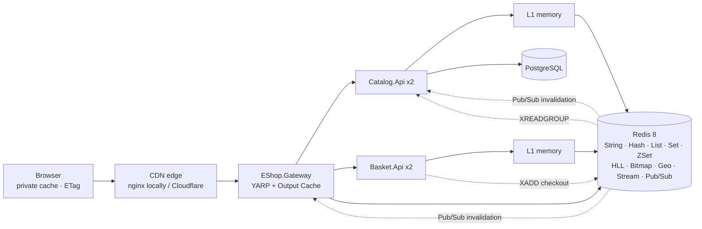

# eShop Caching Deep Dive (.NET 10)

[](https://github.com/amitjain-code/eshop-caching-deep-dive/actions/workflows/ci.yml)

A production-style **.NET 10 eShop API** solution that demonstrates caching at **every level** of a web platform, and uses **every major Redis data structure** for the problem it is best at. Built with **pragmatic clean architecture** and a reusable **caching framework library**.

| Level | Technique in this repo |
|---|---|
| 1. Browser | `private` / `public` `Cache-Control`, `ETag` + `304 Not Modified`, `Vary` |
| 2. CDN | `s-maxage`, `CDN-Cache-Control` (RFC 9213), `stale-while-revalidate` / `stale-if-error`, `Cache-Tag` / `Surrogate-Key` purge |
| 3. Reverse proxy | YARP + ASP.NET Core Output Cache on a **Redis store**, origin-controlled policy, request coalescing, tag eviction |
| 4. Local app cache | `HybridCache` L1 (memory) with stampede protection, jitter, cross-node invalidation over Pub/Sub |
| 5. Redis | L2 cache + primary store for **carts, sessions, menus, rankings, analytics, events** |

## Architecture



### Solution layout

```
EShop.Caching.slnx
├─ src/
│  ├─ BuildingBlocks/                    # framework code, consumed as libraries
│  │  ├─ EShop.SharedKernel/             # Result, Error, Entity, stream contracts
│  │  ├─ EShop.Caching.Abstractions/     # IAppCache, CachePolicy, ICacheInvalidator, IDistributedLock
│  │  ├─ EShop.Caching/                  # HTTP caching, output cache, CDN purge, HybridCache, Redis primitives
│  │  └─ EShop.ServiceDefaults/          # ProblemDetails, health, OpenAPI, auth
│  ├─ Services/
│  │  ├─ Catalog/  Catalog.Core · Catalog.Infrastructure · Catalog.Api
│  │  └─ Basket/   Basket.Core  · Basket.Infrastructure  · Basket.Api
│  └─ Gateways/EShop.Gateway/            # YARP reverse proxy + Redis output cache
├─ tests/EShop.UnitTests/
├─ deploy/  nginx (CDN edge) · redis.conf
├─ docs/    deep-dive chapters (below)
└─ docker-compose.yml
```

Dependency rule: `Api -> Infrastructure -> Core -> (SharedKernel, Caching.Abstractions)`. Core never references Redis, EF Core or ASP.NET Core. Details in [docs/01-architecture.md](docs/01-architecture.md).

## Redis data structure map

| Structure | eShop problem it solves | Why this structure | Code |
|---|---|---|---|
| String | product/menu L2 cache, rate-limit counters, checkout lock, id sequence | O(1) get/set with TTL, atomic `INCR`, `SET NX PX` | `HybridAppCache`, `RedisRateLimiter`, `RedisDistributedLock` |
| Hash | shopping cart, user session | per-field atomic updates (`HINCRBY`) - no lost updates | `RedisCartRepository`, `RedisUserSessionStore` |
| List | recently viewed | ordered, capped (`LTRIM`), O(1) push | `RedisRecentlyViewedStore` |
| Set | wishlist, session index | uniqueness, O(1) `SISMEMBER`, `SINTER` | `RedisWishlistStore` |
| Sorted Set | best-sellers, type-ahead, sliding-window limiter | always ranked; lexicographic ranges | `RedisBestSellerRanking`, `RedisProductSuggestionIndex` |
| HyperLogLog | unique viewers per product | 12 KB per counter, ±0.81 % | `RedisProductViewCounter` |
| Bitmap | daily/weekly active users | 1 bit per user, `BITOP OR` for ranges | `RedisActiveUserTracker` |
| Geo | stores near me | radius search on geohash | `RedisStoreLocator` |
| Stream | checkout events -> best-seller projection | durable log, consumer groups, ack | `RedisCheckoutEventPublisher`, `BestSellerProjector` |
| Pub/Sub | invalidate L1 on all nodes + gateway | live fan-out, loss-tolerant | `RedisCacheInvalidator`, `CacheInvalidationSubscriber` |

Each one is explained as **problem → structure → commands → code** in [docs/03-redis-data-structures.md](docs/03-redis-data-structures.md).

## The framework library in two lines

```csharp
builder.AddEShopCaching(o => o.ServiceName = "catalog");                    // Redis, HybridCache, invalidation, lock, rate limit, metrics
group.MapGet("/{id:int}", GetAsync).CacheHttp(HttpCacheProfiles.PublicCatalog); // browser + CDN + proxy headers, ETag/304
```

```csharp
// Application layer - cache-aside through a port, keys/tags in one place
var product = await cache.GetOrCreateAsync(
    CatalogCache.Keys.Product(id),
    async ct => await repository.GetProductAsync(id, ct),
    CachePolicy.HotEntity,                                        // L2 10 min, L1 1 min, +10% jitter
    [CatalogCache.Tags.Product(id), CatalogCache.Tags.Products],
    cancellationToken);

// Write path - one call invalidates L1 (every node), L2, gateway and CDN
await invalidator.InvalidateAsync(new CacheInvalidation(
    Tags: [CatalogCache.Tags.Product(id), CatalogCache.Tags.Products],
    Keys: [CatalogCache.Keys.Product(id)]), ct);
```

## Quick start

Prerequisites: .NET 10 SDK, Docker.

```bash
git clone https://github.com/amitjain-code/eshop-caching-deep-dive.git
cd eshop-caching-deep-dive
dotnet build EShop.Caching.slnx && dotnet test EShop.Caching.slnx
docker compose up --build -d
curl -si http://localhost:8080/api/catalog/products/1     # watch X-Edge-Cache / X-Gateway-Cache / ETag
```

The full guided tour (304s, invalidation across replicas, carts, sessions, streams, HLL, bitmaps, geo) is in [docs/05-try-it.md](docs/05-try-it.md).

## Deep-dive chapters

1. [Architecture](docs/01-architecture.md) - pragmatic clean architecture, framework library, read and write flows
2. [The five caching layers](docs/02-caching-layers.md) - browser, CDN, reverse proxy, local L1, Redis
3. [Redis data structures](docs/03-redis-data-structures.md) - one eShop problem per structure
4. [Patterns and pitfalls](docs/04-patterns-and-pitfalls.md) - stampede, penetration, avalanche, hot/big keys, checklist
5. [Try it](docs/05-try-it.md) - curl + redis-cli walkthrough

## Tech stack

.NET 10 · ASP.NET Core Minimal APIs · `Microsoft.Extensions.Caching.Hybrid` · Output Caching + StackExchange.Redis store · YARP · StackExchange.Redis · EF Core + Npgsql · Redis 8 · PostgreSQL 17 · nginx · xUnit · GitHub Actions (Release build with warnings as errors).

> Authentication uses a demo header scheme (`X-User-Id`, `X-User-Roles`) so caching behaviour is easy to explore with curl. Replace it with JWT bearer / OpenID Connect before production use.
