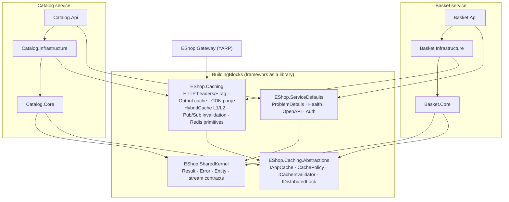
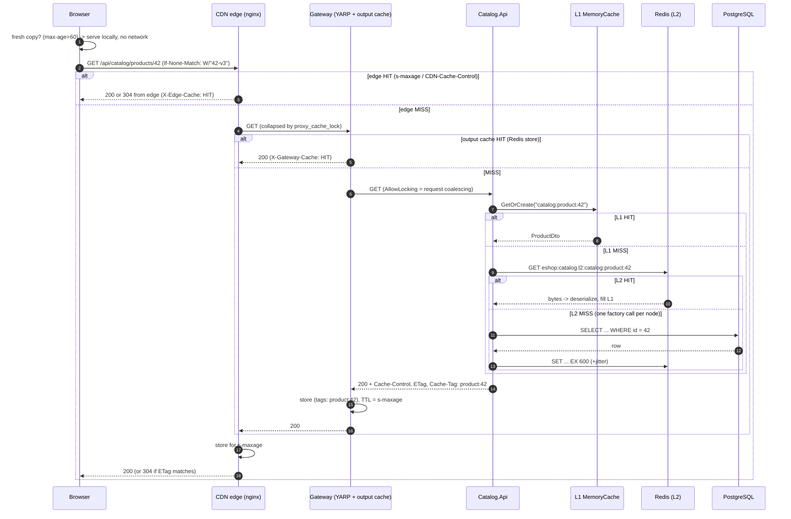
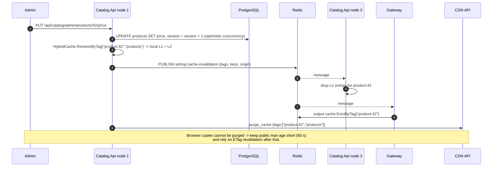
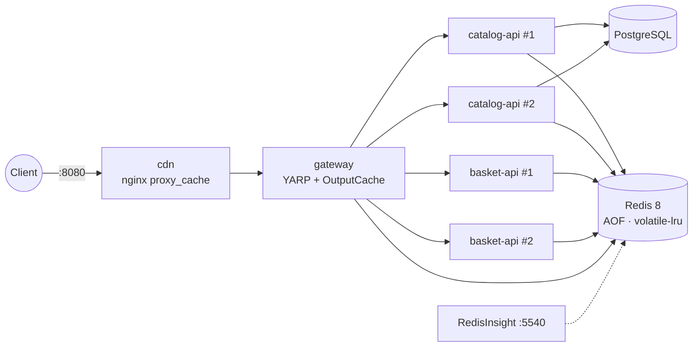

# 01 · Architecture

> How the solution is organised, why it is organised that way, and how a request travels through every cache layer.

## 1. Pragmatic clean architecture

Classic clean architecture splits every service into four projects (Domain, Application, Infrastructure, Presentation). That is a lot of ceremony for a service with a handful of use cases. This solution keeps the **dependency rule** but collapses the two inner rings into one project:

| Ring | Project | Depends on | Contains |
|---|---|---|---|
| Core (Domain + Application) | `Catalog.Core`, `Basket.Core` | `EShop.SharedKernel`, `EShop.Caching.Abstractions` | Entities, domain errors, use-case handlers, **ports** (interfaces) such as `ICartRepository`, `IStoreLocator`, `IAppCache` |
| Infrastructure | `Catalog.Infrastructure`, `Basket.Infrastructure` | Core + `EShop.Caching` | EF Core, Redis adapters (one class per data structure), hosted services |
| Presentation | `Catalog.Api`, `Basket.Api`, `EShop.Gateway` | Infrastructure + `EShop.ServiceDefaults` | Minimal-API endpoints, HTTP cache profiles, composition root |

The rule that matters: **Core never references Redis, EF Core or ASP.NET Core.** It talks to caches through `IAppCache`, `ICacheInvalidator` and `IDistributedLock`, which live in a dependency-free abstractions package. Swapping Redis for Garnet/Valkey/Azure Managed Redis, or HybridCache for FusionCache, touches Infrastructure only.



### Why one Core project instead of Domain + Application?

* Use cases are small (`GetProductByIdHandler` is ~30 lines). Splitting them from the entities they use adds navigation cost and no protection.
* The **port interfaces** are what keep infrastructure out, and they live in Core either way.
* If a service grows, splitting `Core` into `Domain` and `Application` is a mechanical refactor because the dependency direction is already correct.

### Why no MediatR?

Handlers are plain classes registered in DI and injected straight into endpoints. Fewer abstractions, explicit call graph, zero reflection. Cross-cutting behaviour (caching headers, rate limiting, activity tracking) is applied with **endpoint filters**, which is the native ASP.NET Core pipeline for that job.

## 2. The framework library: `EShop.Caching`

Everything reusable about caching lives in one library so each service only *declares* intent:

```csharp
builder.AddEShopCaching(o => o.ServiceName = "catalog");      // Redis, HybridCache, invalidation, lock, rate limiter
group.MapGet("/{id:int}", GetAsync).CacheHttp(HttpCacheProfiles.PublicCatalog);  // browser + CDN + proxy headers
```

| Folder | What it gives you | Main types |
|---|---|---|
| `Http/` | Cache-Control / CDN-Cache-Control / Vary / ETag / Last-Modified / Cache-Tag headers and 304 handling | `HttpCacheProfile`, `HttpCacheProfiles`, `HttpCacheEndpointFilter`, `.CacheHttp()` |
| `OutputCaching/` | Reverse-proxy cache that obeys the origin's headers, Redis store, tag eviction | `OriginControlledOutputCachePolicy`, `AddEShopOutputCache()` |
| `Cdn/` | Purge by tag at the CDN edge | `ICdnPurger`, `CloudflareCdnPurger`, `NoOpCdnPurger` |
| `Hybrid/` | Two-level application cache with stampede protection, jitter and metrics | `HybridAppCache : IAppCache` |
| `Invalidation/` | One call invalidates L1 on every node, L2, gateway and CDN | `RedisCacheInvalidator`, `CacheInvalidationSubscriber`, `ICacheInvalidationHandler` |
| `Redis/` | Key-prefixed database, distributed lock, health check | `IRedisStore`, `RedisDistributedLock`, `RedisHealthCheck` |
| `RateLimiting/` | Distributed fixed-window (String) and sliding-window (Sorted Set) limiter | `RedisRateLimiter`, `.RequireRedisRateLimit()` |
| `Diagnostics/` | `eshop.cache.lookups{cache.name,cache.result}` and invalidation counters | `CacheMetrics` |
| `DependencyInjection/` | One-line registration | `AddEShopCaching()` |

**Extension points.** Add a new CDN by implementing `ICdnPurger`. Add a new cache layer that must react to writes (for example a search index cache) by implementing `ICacheInvalidationHandler` and registering it; the invalidator and Pub/Sub subscriber call every registered handler.

## 3. Read path: one product request through every layer



Each layer only does work when the layer in front of it missed. Under normal traffic most requests never leave the browser or the edge.

## 4. Write path: invalidating every layer



Order matters: **write the source of truth first, then invalidate.** Invalidating first opens a window where a concurrent reader re-populates the cache with the old row.

## 5. Deployment topology (docker-compose)



Two replicas of each API are deliberate: they make the classic distributed-cache problems visible (stale L1 on the other node, sticky sessions, duplicate checkout) so you can watch the solution handle them.

## 6. Key naming

All service-owned keys are prefixed automatically by `IRedisStore.Database` (`WithKeyPrefix`):

```
eshop:{service}:{entity}:{id}[:{qualifier}]

eshop:catalog:l2:catalog:product:42      HybridCache L2 entry (String)
eshop:catalog:bestsellers:20261001       Sorted Set
eshop:catalog:stores:geo                 GEO set
eshop:basket:cart:alice                  Hash
eshop:basket:recent:alice                List
eshop:basket:wishlist:alice              Set
eshop:basket:session:{id}                Hash
eshop:basket:dau:20261001                Bitmap (String)
eshop:gateway:output:...                 Output cache entries + tag sets
eshop:streams:checkout                   Stream (shared, un-prefixed)
```

A prefix per service gives you `SCAN MATCH eshop:basket:*` for debugging, ACL rules per service (`~eshop:basket:*`) and safe co-location of several services on one Redis.
