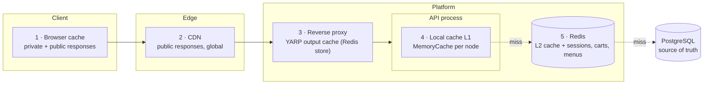
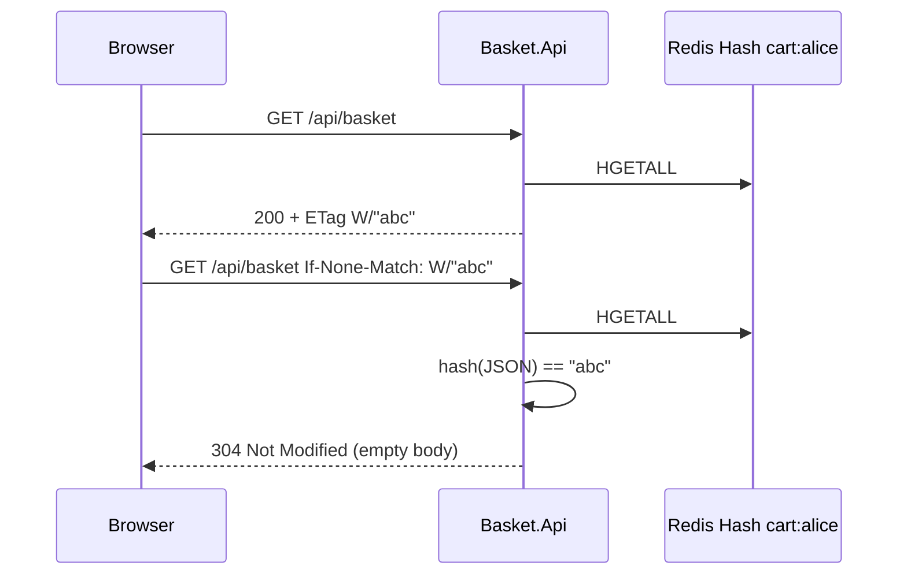
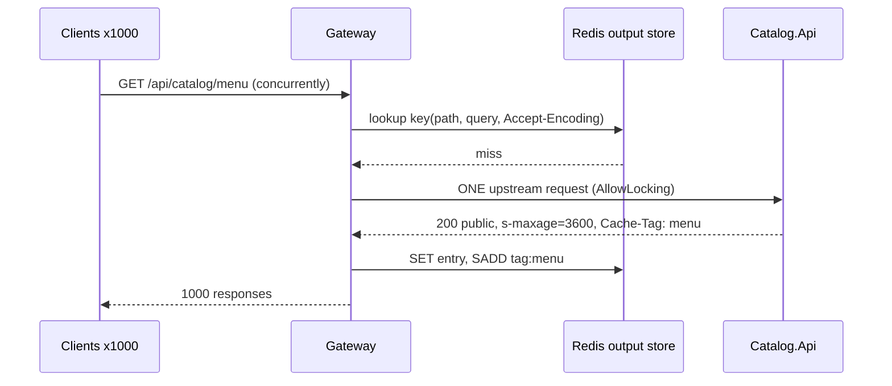
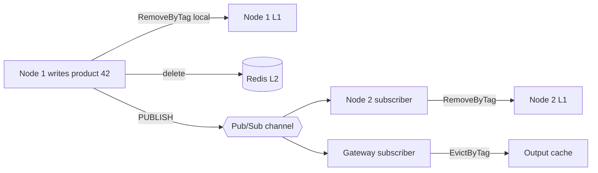

# 02 · The five caching layers

> Each layer is described the same way: **the problem**, **how the layer solves it**, **the code in this repo**, **what can go wrong**.



| # | Layer | Who sees it | What we cache | Lifetime | Invalidation | Code |
|---|---|---|---|---|---|---|
| 1 | Browser | one user | basket, wishlist (private); catalog (public) | `max-age` 0-300 s | **cannot purge** - ETag revalidation | `HttpCacheProfiles.Private*`, `HttpCacheEndpointFilter` |
| 2 | CDN | everyone, per PoP | product, listing, menu JSON | `CDN-Cache-Control` 10 min - 1 day | purge by `Cache-Tag` | `CloudflareCdnPurger`, `deploy/nginx/nginx.conf` |
| 3 | Reverse proxy | everyone, per region | same public responses | `s-maxage` 60 s - 1 h | `EvictByTag` via Pub/Sub | `OriginControlledOutputCachePolicy` |
| 4 | Local L1 | one API node | DTOs, menu tree, id maps | 30 s - 10 min | Pub/Sub broadcast | `HybridAppCache`, `IMemoryCache` |
| 5 | Redis | all nodes | L2 DTO copies + primary data (cart, session, rankings) | minutes - 30 days | tags / keys / TTL | `IRedisStore`, Redis adapters |

---

## 1. Browser cache - user-specific HTTP responses

### Problem
The basket badge and the basket page call `GET /api/basket` on every navigation. The basket rarely changes between two clicks, yet each call ships the whole JSON. Shared caches must **never** store it (it is Alice's basket), and the browser must never show a stale basket after she adds an item.

### Solution: `private` + `max-age=0` + `must-revalidate` + `ETag`
```http
GET /api/basket                       X-User-Id: alice
200 OK
Cache-Control: private, max-age=0, must-revalidate
Vary: X-User-Id, Authorization
ETag: W/"9f2c1a0e5b7d41c3a8e2f06b"

GET /api/basket                       X-User-Id: alice
If-None-Match: W/"9f2c1a0e5b7d41c3a8e2f06b"
304 Not Modified                       (no body)
```

* `private` - only the end-user's browser may store it. CDNs and proxies must not.
* `max-age=0, must-revalidate` - the browser keeps the copy but asks the server every time.
* `ETag` - the server answers `304` with no body when nothing changed. Bandwidth saved, correctness kept.
* `Vary: X-User-Id, Authorization` - if two users share a browser profile, one never sees the other's cached basket.



### Code
```csharp
group.MapGet("/", GetAsync).CacheHttp(HttpCacheProfiles.PrivateRevalidate);
recent.MapGet("/", GetRecentAsync).CacheHttp(HttpCacheProfiles.PrivateShortLived); // private, max-age=30
```
`HttpCacheEndpointFilter` builds the ETag in two ways:

| Response type | ETag source | Cost |
|---|---|---|
| implements `IVersionedResource` (`ProductDto`) | entity version: `W/"42-v3"` | free |
| anything else (`CartDto`, `MenuDto`) | SHA-256 of the JSON, first 12 bytes | one extra serialization |

### Pitfalls
* A browser cache **cannot be purged**. Anything public with `max-age=3600` stays stale for an hour on every device. Keep public `max-age` short and give shared caches the long lifetimes (`s-maxage`, `CDN-Cache-Control`) that you *can* purge.
* Errors must not be cached: the filter writes `Cache-Control: no-store` on any non-200 result.
* `no-cache` means "store but revalidate", `no-store` means "do not store". Sessions and checkout use `no-store`.

---

## 2. CDN - public API responses at the edge

### Problem
Product pages, listings and the navigation menu are identical for every anonymous visitor. Serving them from one region adds 100-300 ms for distant users and every request costs origin CPU.

### Solution: shared-cache directives + surrogate keys
```http
Cache-Control: public, max-age=60, s-maxage=300, stale-while-revalidate=60, stale-if-error=3600
CDN-Cache-Control: max-age=600
Cache-Tag: product:42                 # Cloudflare (comma separated)
Surrogate-Key: product:42             # Fastly / Varnish (space separated)
ETag: W/"42-v3"
Last-Modified: Thu, 01 Oct 2026 09:30:00 GMT
```

| Directive | Audience | Meaning |
|---|---|---|
| `max-age=60` | browser | fresh for 60 s |
| `s-maxage=300` | all shared caches (gateway, nginx) | fresh for 5 min, overrides `max-age` |
| `CDN-Cache-Control: max-age=600` (RFC 9213) | CDN only | 10 min at the edge, even if `s-maxage` is shorter |
| `stale-while-revalidate=60` | any cache | serve stale for 60 s while refreshing in background - no user waits for the origin |
| `stale-if-error=3600` | any cache | serve stale for 1 h if the origin fails - free resilience |
| `Cache-Tag` / `Surrogate-Key` | CDN | lets one purge call remove every URL that rendered product 42 |

**Purge on write.** `RedisCacheInvalidator` calls `ICdnPurger.PurgeTagsAsync(["product:42","products"])`. With `Caching:Cdn:Provider = Cloudflare` this posts to `/zones/{zone}/purge_cache` in batches of 30 tags. A failed purge is logged, not thrown: content still expires by itself.

### Local simulation
`deploy/nginx/nginx.conf` plays the edge: it honours `s-maxage`, `stale-while-revalidate`, `stale-if-error`, collapses concurrent misses (`proxy_cache_lock`), revalidates with ETags (`proxy_cache_revalidate`) and bypasses the cache when `X-User-Id` or `Authorization` is present. Every response carries `X-Edge-Cache: HIT | MISS | EXPIRED | STALE | UPDATING | BYPASS`.

### Pitfalls
* **Never** put personalised data behind `public`. One cached basket served to the world is a data breach. The filter only emits `Cache-Tag` for `public` profiles and the gateway/edge skip requests with identity headers.
* **Cache-key explosion**: `?utm_source=...` creates a new edge entry per campaign. Normalise or strip tracking parameters at the CDN.
* **Side effects on GET** never reach the origin when the edge answers. That is why product views are recorded with `POST /api/catalog/products/{id}/views` (a beacon), not inside `GET /products/{id}`.

---

## 3. Reverse proxy - YARP output cache for public API responses

### Problem
CDN PoPs each miss independently, and internal clients (mobile BFF, other services) call the gateway directly. A burst of traffic for a newly launched product would fan out to every API node.

### Solution: an origin-controlled shared cache in the gateway, stored in Redis
```json
"catalog-public": {
  "ClusterId": "catalog",
  "OutputCachePolicy": "PublicApi",
  "Match": { "Path": "/api/catalog/{**rest}", "Methods": [ "GET", "HEAD" ] }
}
```
`OriginControlledOutputCachePolicy` behaves like a polite RFC 9111 shared cache:

1. Look up / store only anonymous `GET`/`HEAD` (no `Authorization`, `Cookie`, `X-User-Id`).
2. Store only `200` responses that are `public`, not `private`/`no-store`/`no-cache`, without `Set-Cookie`.
3. Lifetime = `s-maxage` (fallback `max-age`). **The API owns the policy, the gateway obeys.**
4. Tag the entry with the origin's `Cache-Tag` values, so `EvictByTagAsync("product:42")` removes it.
5. `AllowLocking = true` - request coalescing: 1 000 concurrent misses for the same key produce one upstream call.

The store is `AddStackExchangeRedisOutputCache`, so **every gateway replica shares one cache** and one eviction. The gateway also runs `CacheInvalidationSubscriber`; when Catalog publishes an invalidation, `OutputCacheInvalidationHandler` evicts the tags.



### Pitfalls
* Output caching after authentication middleware will happily cache per-route responses that vary by user. Keep the policy on public routes only (`catalog-public`), never on `basket`.
* Vary rules: the policy varies by all query keys and by `Accept`/`Accept-Encoding`. Add `Accept-Language` if you localise.

---

## 4. Local application cache (L1) - frequently read objects

### Problem
The menu is rendered on every page; hot products are read thousands of times per second. Even Redis costs a network round trip (~0.3-1 ms) plus deserialization for each read, and a single hot key can saturate one Redis shard.

### Solution: in-process memory in front of Redis, via `HybridCache`
```csharp
var menu = await cache.GetOrCreateAsync(
    CatalogCache.Keys.Menu,                         // "catalog:menu"
    async ct => BuildMenu(await repo.GetCategoriesAsync(ct), await repo.GetBrandsAsync(ct)),
    CachePolicy.ReferenceData,                      // L2 6 h, L1 10 min, +10% jitter
    [CatalogCache.Tags.Menu],
    ct);
```

| Policy | L2 (Redis) | L1 (memory) | Used for |
|---|---|---|---|
| `ReferenceData` | 6 h | 10 min | menu, categories, brands, store list |
| `HotEntity` | 10 min | 1 min | product detail |
| `Listing` | 2 min | 30 s | paged listings |

What `HybridCache` adds over raw `IMemoryCache` + `IDistributedCache`:

* **Stampede protection** - concurrent misses for one key on one node run the factory once; the rest await the same task.
* **Two levels with one call** - L1 hit -> L2 hit (and L1 refill) -> factory -> write both.
* **Tags** - `RemoveByTagAsync("product:42")`.
* **Payload limit** - entries above `MaximumPayloadBytes` (1 MB here) are not cached, protecting Redis from big keys.

### The coherence problem and how it is solved
HybridCache invalidation is **local + L2 only**: node 2 keeps serving its L1 copy until it expires. `RedisCacheInvalidator` therefore publishes every invalidation on `eshop:cache-invalidation`; `CacheInvalidationSubscriber` on every node replays it locally. Nodes ignore their own echo through `CacheNodeIdentity`.



Pub/Sub is fire-and-forget. A node that is disconnected for a moment misses the message; the short L1 lifetime (1-10 min) bounds the staleness. That trade-off is why L1 lifetimes are deliberately much shorter than L2 lifetimes.

**Plain `IMemoryCache` is still used** where data never changes: `RedisActiveUserTracker` caches the immutable `userId -> bit offset` mapping in memory so the bitmap write costs one Redis command instead of two.

---

## 5. Redis - shared sessions, carts, menus

Redis plays two roles in this solution and it is important not to confuse them:

| Role | Data | Loss tolerance | Settings |
|---|---|---|---|
| **Cache** (copy of something else) | HybridCache L2 entries, output cache, menu | lose it, rebuild from DB | TTL on every key, evictable |
| **Primary store** (only copy) | carts, user sessions, rankings, bitmaps, checkout stream | should survive restarts | AOF `everysec`, TTL where natural |

`deploy/redis/redis.conf` uses `maxmemory-policy volatile-lru`: only keys **with** a TTL can be evicted, so the checkout stream and id map are never dropped under memory pressure. In production split the roles into two Redis deployments (`allkeys-lru` cache, `noeviction` + persistence for data).

### Shared sessions
* **Anonymous preferences** - ASP.NET Core `AddSession()` over `IDistributedCache` (= Redis). The session cookie is just an id; any replica can read the session. No sticky sessions.
* **Signed-in sessions** - `RedisUserSessionStore`: a Hash per session (sliding 30 min TTL) and a Set per user indexing the session ids. Listing devices, revoking one, and "sign out everywhere" are each a couple of commands, and revocation is instant on every node (unlike a self-contained JWT).

### Carts
`RedisCartRepository` stores each cart as a Hash with one field per line, mutated atomically with `HINCRBY` inside a Lua script. Details in [03 · Redis data structures](03-redis-data-structures.md#2-hash).

### Menus
The menu is cached in L2 (Redis String) for 6 h and in L1 for 10 min, and published with `PublicReferenceData` headers (browser 5 min, gateway 1 h, CDN 1 day). A category change invalidates the `menu` tag at every layer.

---

## TTL cheat-sheet

| Response / object | Browser | Gateway (`s-maxage`) | CDN | L1 | L2 |
|---|---|---|---|---|---|
| `GET /api/catalog/menu` | 5 min | 1 h | 1 day + purge | 10 min | 6 h |
| `GET /api/catalog/products/{id}` | 60 s | 5 min | 10 min + purge | 1 min | 10 min |
| `GET /api/catalog/products?page=` | 60 s | 5 min | 10 min + purge | 30 s | 2 min |
| `GET /api/catalog/bestsellers` | 30 s | 60 s | 60 s | - | ZSET roll-up 60 s |
| `GET /api/basket` | 0 s + ETag | never | never | - | cart Hash 30 days |
| `GET /api/basket/recently-viewed` | 30 s | never | never | - | List 30 days |
| sessions / checkout | `no-store` | never | never | - | session Hash 30 min sliding |
