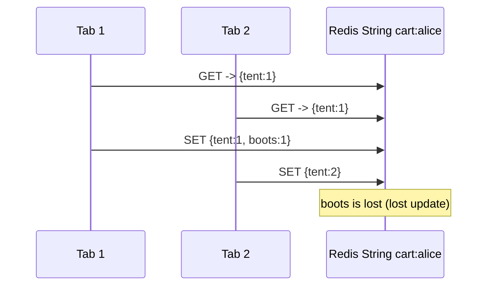
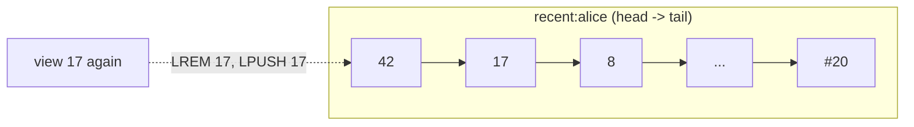
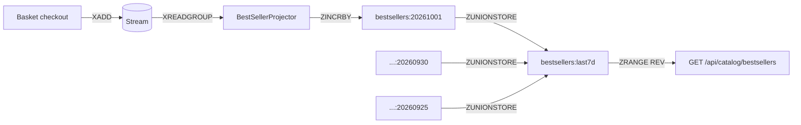
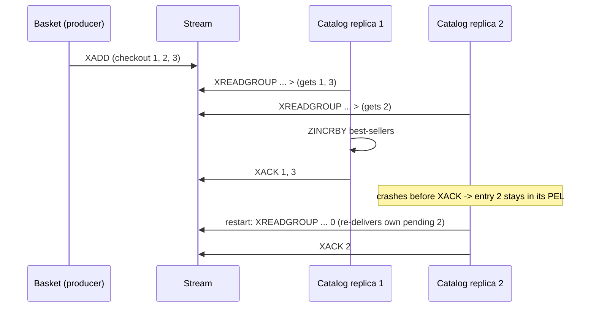
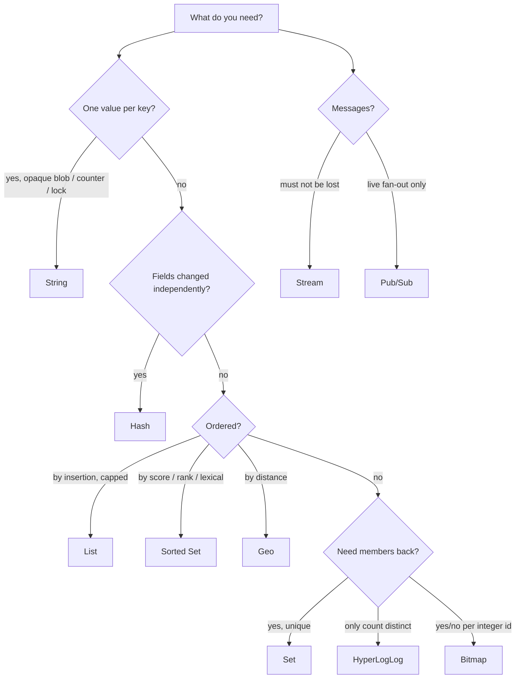

# 03 · Redis data structures, one eShop problem each

> Redis is not "a key/value cache". It is a server of data structures. Choosing the right one turns
> a read-modify-write race, a slow `ORDER BY`, or a 500 MB set into a single O(1) / O(log N) command.

| # | Structure | eShop problem | Key | Main commands | Code |
|---|---|---|---|---|---|
| 1 | **String** | cache entries, counters, locks, id sequence | `l2:catalog:product:42`, `ratelimit:*`, `lock:*` | `GET/SET EX`, `INCR`, `SET NX PX` | `HybridAppCache`, `RedisRateLimiter`, `RedisDistributedLock` |
| 2 | **Hash** | shopping cart, user session | `cart:{user}`, `session:{id}` | `HINCRBY`, `HSET`, `HGETALL`, `HDEL` | `RedisCartRepository`, `RedisUserSessionStore` |
| 3 | **List** | recently viewed products | `recent:{user}` | `LREM`, `LPUSH`, `LTRIM`, `LRANGE` | `RedisRecentlyViewedStore` |
| 4 | **Set** | wishlist, session index | `wishlist:{user}`, `user-sessions:{user}` | `SADD`, `SISMEMBER`, `SINTER`, `SMEMBERS` | `RedisWishlistStore`, `RedisUserSessionStore` |
| 5 | **Sorted Set** | best-sellers, type-ahead, sliding-window rate limit | `bestsellers:{day}`, `suggest:products` | `ZINCRBY`, `ZUNIONSTORE`, `ZRANGE ... REV`, `ZRANGEBYLEX` | `RedisBestSellerRanking`, `RedisProductSuggestionIndex`, `RedisRateLimiter` |
| 6 | **HyperLogLog** | unique product viewers | `views:{product}:{day}` | `PFADD`, `PFCOUNT` | `RedisProductViewCounter` |
| 7 | **Bitmap** | daily / weekly active users | `dau:{day}` | `SETBIT`, `BITCOUNT`, `BITOP OR` | `RedisActiveUserTracker` |
| 8 | **Geo** | stores near me | `stores:geo` | `GEOADD`, `GEOSEARCH` | `RedisStoreLocator` |
| 9 | **Stream** | checkout events -> best-seller projection | `eshop:streams:checkout` | `XADD`, `XREADGROUP`, `XACK` | `RedisCheckoutEventPublisher`, `BestSellerProjector` |
| 10 | **Pub/Sub** | invalidate L1 on every node | channel `eshop:cache-invalidation` | `PUBLISH`, `SUBSCRIBE` | `RedisCacheInvalidator`, `CacheInvalidationSubscriber` |

---

## 1. String

### Problem A - cache a serialized object (L2)
Product details are read thousands of times per minute and come from a 3-table join.

**Structure.** A String holds up to 512 MB of bytes; `SET key value EX ttl` stores and expires atomically. HybridCache uses the Redis `IDistributedCache`, which stores each entry as a String (with expiry metadata).

```text
SET eshop:catalog:l2:catalog:product:42 <json bytes> EX 660     # 600 s + jitter
GET eshop:catalog:l2:catalog:product:42                          # O(1)
```

### Problem B - count requests across replicas (fixed-window rate limit)
"Max 5 checkouts per user per minute" must hold across *all* Basket replicas, so an in-memory counter is useless.

```lua
-- RedisRateLimiter.FixedWindowScript  (KEYS[1] = ratelimit:fixed:checkout:alice:{minute})
local current = redis.call('INCR', KEYS[1])
if current == 1 then redis.call('PEXPIRE', KEYS[1], ARGV[1]) end
return { current, redis.call('PTTL', KEYS[1]) }
```
`INCR` is atomic; doing it in Lua makes `INCR` + `PEXPIRE` atomic too (a crash between them would otherwise leave an immortal counter).

### Problem C - stop double checkout (distributed lock)
Two tabs click "Place order" at the same time and land on different replicas.

```text
SET lock:checkout:alice <random token> NX PX 30000      # acquire only if absent, auto-expire
... publish event, delete cart ...
if GET lock == token then DEL lock                       # compare-and-delete (LockReleaseAsync)
```
The random token ensures a slow node whose lease expired cannot delete a lock that another node now owns. Use this for *efficiency* (avoid duplicate work). For correctness-critical mutual exclusion add fencing tokens or use the database.

### Problem D - dense integer ids for bitmaps
`INCR {users}:seq` hands out 1, 2, 3 ... - see [Bitmap](#7-bitmap).

---

## 2. Hash

### Problem - the shopping cart
Naive approach: the cart as one JSON String.


Every click is a read-modify-write of the whole document, and concurrent clicks overwrite each other.

### Structure
A Hash is a map of field -> value inside one key. Fields can be read, written and incremented **individually and atomically**.

```text
cart:alice
  qty:17   -> 2                                  HINCRBY cart:alice qty:17 1
  item:17  -> {"Name":"Trail Tent","Price":199.99,"Picture":"..."}
  qty:42   -> 1
  item:42  -> {...}
```

```lua
-- RedisCartRepository.AddOrIncrementScript
local qty = redis.call('HINCRBY', KEYS[1], 'qty:' .. ARGV[1], ARGV[2])
if qty <= 0 then
  redis.call('HDEL', KEYS[1], 'qty:' .. ARGV[1], 'item:' .. ARGV[1])
else
  redis.call('HSET', KEYS[1], 'item:' .. ARGV[1], ARGV[3])
end
redis.call('EXPIRE', KEYS[1], ARGV[4])          -- 30-day sliding lifetime
return qty
```

| Operation | Commands | Complexity |
|---|---|---|
| add / increment line | `HINCRBY` + `HSET` (Lua) | O(1) |
| change quantity | `HEXISTS` + `HSET` (Lua) | O(1) |
| remove line | `HDEL qty:id item:id` | O(1) |
| read cart | `HGETALL` | O(lines) |
| empty after checkout | `DEL` | O(lines) |

Small hashes (< 128 fields, values < 64 bytes by default) are stored as a compact listpack, so a typical cart costs a few hundred bytes.

### Same structure, second problem - user sessions
`session:{id}` is a Hash (`userId`, `createdAt`, `lastSeenAt`, `userAgent`, `ip`). Touching a session updates **one field** (`HSET lastSeenAt`) and slides the TTL (`EXPIRE 1800`) instead of rewriting a blob.

---

## 3. List

### Problem - "recently viewed" strip
Needs: newest first, no duplicates, at most 20 items, cheap to append on every product view.

### Structure
A List is a linked sequence with O(1) push/pop at both ends; `LTRIM` caps it.

```text
MULTI
  LREM   recent:alice 0 42      -- remove previous occurrence of 42 (de-dupe)
  LPUSH  recent:alice 42        -- newest at the head
  LTRIM  recent:alice 0 19      -- keep 20 -> memory is bounded forever
  EXPIRE recent:alice 2592000
EXEC
LRANGE recent:alice 0 9          -- the 10 most recent
```



Why not a Set? No order. Why not a Sorted Set (score = timestamp)? Works, but costs more memory per member and a List already gives the order for free. `LREM` is O(N) but N is capped at 20.

---

## 4. Set

### Problem - wishlist hearts on every product tile
A listing page shows 24 tiles and each needs "is this in Alice's wishlist?". Duplicates must be impossible.

### Structure
An unordered collection of unique members with O(1) membership and server-side set algebra.

```text
SADD      wishlist:alice 17 42 99      -- idempotent
SISMEMBER wishlist:alice 42            -- O(1)  -> 1
SMEMBERS  wishlist:alice               -- O(N)
SINTER    wishlist:alice wishlist:bob  -- "what do we both want?" computed in Redis
```

Second use: `user-sessions:alice` is a Set of session ids. It is an **index** so "list my devices" and "sign out everywhere" do not need `SCAN`. Expired session Hashes are cleaned out of the index lazily by `ListAsync`.

---

## 5. Sorted Set

A Sorted Set keeps unique members ordered by a floating-point score (skip list + hash table): O(log N) insert/update, O(log N + M) range reads.

### Problem A - best-sellers leaderboard
`SELECT product_id, SUM(qty) FROM order_lines WHERE created > now()-7d GROUP BY 1 ORDER BY 2 DESC LIMIT 10` gets slower every day as orders grow, and runs on every home-page view.

```text
ZINCRBY bestsellers:20261001 3 "42"                                  -- per checkout line, O(log N)
ZUNIONSTORE bestsellers:last7d 7 bestsellers:20261001 ... :20260925  -- roll-up, cached 60 s
ZRANGE bestsellers:last7d 0 9 REV WITHSCORES                         -- top 10, O(log N + 10)
```


Daily keys expire after 35 days, so the leaderboard never grows unbounded and any window (1-30 days) is a union of days.

### Problem B - type-ahead search
Users expect suggestions after 2 characters, within a few milliseconds, without a search cluster.

When **all scores are equal** Redis orders members lexicographically by bytes, which turns the set into a sorted dictionary:

```text
ZADD suggest:products 0 "alpine jacket contoso|Alpine Jacket Contoso|17"
ZRANGE suggest:products "[alp" "[alp\xff" BYLEX LIMIT 0 8
```
The member embeds the normalised name (for matching), the display name and the id, so no second lookup is needed. `\xff` is appended as a raw byte (not a UTF-8 character) to build the upper bound.

### Problem C - exact sliding-window rate limit
The fixed window allows 2x the limit at window boundaries. The sliding version stores one member per request with the timestamp as score:

```lua
redis.call('ZREMRANGEBYSCORE', key, '-inf', now - window)   -- forget old requests
if redis.call('ZCARD', key) < limit then
  redis.call('ZADD', key, now, member); redis.call('PEXPIRE', key, window)
  return { 1, ... }                                           -- allowed
end
```
Trade-off: O(limit) memory per client instead of O(1).

---

## 6. HyperLogLog

### Problem - "1 234 people viewed this product this week"
A Set of visitor ids per product per day is exact but grows linearly: 1 M visitors x 36 bytes x 5 000 products x 7 days is far too much memory for a vanity counter.

### Structure
A probabilistic cardinality estimator: **fixed 12 KB per key**, standard error **0.81 %**, mergeable.

```text
PFADD   views:42:20261001 "alice"                         -- O(1)
PFCOUNT views:42:20261001 views:42:20260930 ... (7 keys)  -- union estimate, no extra storage
```

| | Set of ids | HyperLogLog |
|---|---|---|
| memory for 1 M unique | ~40-60 MB | 12 KB |
| exact | yes | no (+-0.81 %) |
| can list members | yes | no |
| union of days | `SUNION` (allocates) | `PFCOUNT k1 k2 ...` |

Use it whenever the question is *how many distinct*, never *who*.

---

## 7. Bitmap

### Problem - DAU / WAU for the operations dashboard
"How many distinct users used the basket today / this week?"

### Structure
A String addressed bit by bit. Bit *N* = user number *N*.

```text
SETBIT   dau:20261001 1234 1                  -- user #1234 active today, O(1)
BITCOUNT dau:20261001                          -- DAU
BITOP OR active:20261001:7d dau:20261001 ... dau:20260925
BITCOUNT active:20261001:7d                    -- WAU
GETBIT   dau:20261001 1234                     -- was user #1234 active?
```

10 M users = 10 M bits = **1.25 MB per day**. `BITOP AND` answers retention questions ("active today *and* yesterday").

Bitmaps need small dense integers, so string ids are mapped once:

```lua
-- {users} hash tag keeps both keys in the same Redis Cluster slot
local id = redis.call('HGET', '{users}:ids', ARGV[1])
if id then return tonumber(id) end
id = redis.call('INCR', '{users}:seq')
redis.call('HSET', '{users}:ids', ARGV[1], id)
return id
```
The mapping never changes, so it is cached in local `IMemoryCache` - a textbook L1 use.

---

## 8. Geo

### Problem - "pick up today at a store near you"
Computing haversine distance against every store row in SQL on each request does not scale and does not use an index without PostGIS.

### Structure
A Sorted Set whose score is a 52-bit geohash, plus radius/box search commands.

```text
GEOADD    stores:geo 77.2167 28.6315 "1"           -- lon, lat, member
GEOSEARCH stores:geo FROMLONLAT 77.20 28.60 BYRADIUS 25 km ASC COUNT 10 WITHDIST
```
`FindNearbyStoresHandler` gets ids and distances from Redis and joins them with the store list held in the reference-data cache (L1/L2), so a "nearby" query touches PostgreSQL zero times. The index is warmed at startup by `CatalogStartupInitializer` (idempotent `GEOADD`).

Precision is ~0.6 m and latitude is limited to +-85.05 degrees (the domain validates this).

---

## 9. Stream

### Problem - propagate checkouts to other services reliably
Catalog must update best-sellers when Basket checks out. A direct HTTP call couples availability; Pub/Sub loses messages when Catalog is down or restarting.

### Structure
An append-only log with ids (`<ms>-<seq>`), consumer groups, per-consumer pending lists and acknowledgements - Kafka-like semantics inside Redis.

```text
XADD eshop:streams:checkout MAXLEN ~ 100000 * checkoutId .. buyerId alice items [...] total 489.48 occurredAt ..
XGROUP CREATE eshop:streams:checkout catalog-bestsellers 0 MKSTREAM
XREADGROUP GROUP catalog-bestsellers catalog-1 COUNT 50 STREAMS eshop:streams:checkout >
XACK eshop:streams:checkout catalog-bestsellers 1727775000000-0
```



`BestSellerProjector` reads its own pending entries (`0`) first after a restart, then new ones (`>`). `MAXLEN ~` trims approximately (cheap) to bound memory. For entries orphaned by a consumer that never comes back, add `XAUTOCLAIM`.

| | Pub/Sub | Stream |
|---|---|---|
| stored | no | yes (until trimmed) |
| offline consumer | misses messages | catches up |
| load balancing | every subscriber gets every message | consumer group shares the work |
| ack / retry | no | `XACK`, pending list, `XCLAIM` |
| used here for | cache invalidation (loss is tolerable) | checkout events (loss is not) |

---

## 10. Pub/Sub

### Problem - L1 caches on N nodes go stale after a write
See [02 · Local cache](02-caching-layers.md#4-local-application-cache-l1---frequently-read-objects).

### Structure
Fire-and-forget fan-out: `PUBLISH` delivers the message to every client currently `SUBSCRIBE`d to the channel; nothing is stored.

```text
SUBSCRIBE eshop:cache-invalidation                                  -- every API node and the gateway
PUBLISH   eshop:cache-invalidation '{"Origin":"node-1","Tags":["product:42","products"],"Keys":["catalog:product:42"]}'
```
It fits cache invalidation exactly: every node must hear it *now*, and a node that misses it self-heals when its short L1 TTL expires. In Redis Cluster prefer **sharded Pub/Sub** (`SPUBLISH`/`SSUBSCRIBE`) so messages are not broadcast to every shard.

---

## Bonus: structures worth knowing in Redis 8

Redis 8 ships the former modules in the core server:

| Structure | When it would fit eShop |
|---|---|
| **Bloom filter** (`BF.ADD`, `BF.EXISTS`) | reject lookups for product ids that cannot exist before touching cache or DB (cache penetration), "has this coupon code ever been used" |
| **JSON** (`JSON.SET`, `JSON.NUMINCRBY $.lines[0].qty`) | a cart that must keep nested structure with partial atomic updates |
| **Time series** (`TS.ADD`, `TS.RANGE`) | per-minute sales or cache hit-ratio charts |
| **Vector sets / Query Engine** | semantic product search, "similar products" |

## Picking a structure - decision guide


