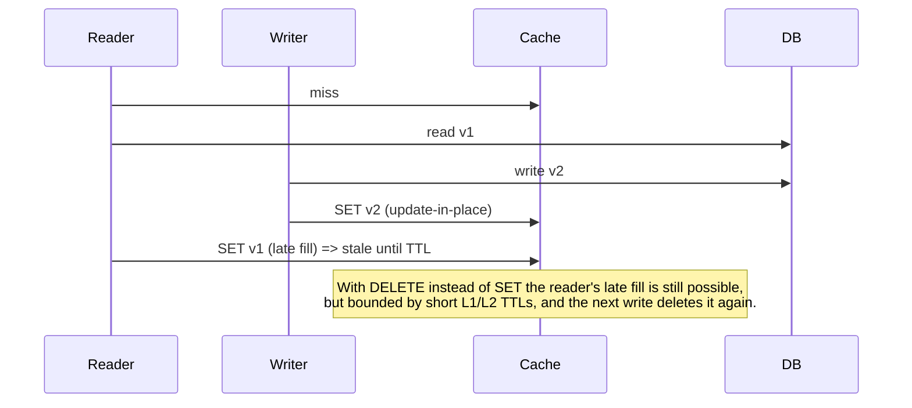

# 04 · Patterns, failure modes and a production checklist

## 1. Write strategies

| Pattern | Read | Write | Consistency | Used here |
|---|---|---|---|---|
| **Cache-aside** (lazy loading) | app checks cache, loads DB on miss, fills cache | app writes DB, then invalidates | eventual, bounded by TTL | product, listing, menu, stores (`IAppCache`) |
| Read-through | cache library loads on miss | - | same as cache-aside | HybridCache's `GetOrCreateAsync` *is* read-through from the caller's point of view |
| Write-through | - | write cache and DB together | strong-ish, slower writes | not used (cache would hold rarely read data) |
| Write-behind | - | write cache, flush to DB later | risk of loss | not used |
| **Redis as primary store** | Redis | Redis (+AOF) | Redis is the truth | cart, sessions, rankings, bitmaps, stream |

Invalidate, don't update: deleting a key after a write is idempotent and race-tolerant; writing the new value into the cache from the write path can lose to a concurrent reader that loaded the *old* row a moment earlier.

## 2. Failure modes and their fixes

### Cache stampede (dog-piling)
*A hot key expires; 5 000 concurrent requests miss and all hit the database.*

| Layer | Mitigation in this repo |
|---|---|
| Browser / CDN | `stale-while-revalidate` - users get the stale copy while one background refresh runs |
| nginx edge | `proxy_cache_lock on` - one request goes upstream per key |
| Gateway | `AllowLocking = true` in `OriginControlledOutputCachePolicy` |
| L1/L2 | HybridCache runs the factory once per key per node |
| Fleet-wide | `CachePolicy.JitterFactor` spreads expirations so keys written together do not expire together |

### Cache penetration
*Requests for ids that do not exist always miss and always hit the database (bots, scanners).*
* **Negative caching** - `GetProductByIdHandler` caches `null` for unknown ids for the same short policy.
* Validate input early (`id <= 0` is rejected before touching any cache).
* For very large key spaces, put a **Bloom filter** (Redis 8 `BF.EXISTS`) in front.

### Cache avalanche
*Redis restarts or a whole tier expires at once.*
* Jittered TTLs, L1 in front of L2 (nodes keep serving from memory), `stale-if-error` at HTTP layers.
* `AbortOnConnectFail = false`: the app starts and keeps retrying instead of crashing when Redis is briefly unavailable.
* Redis health check is tagged `ready`, not `live` - Kubernetes stops routing to a node without killing it.

### Hot keys
*One key (the menu, a viral product) receives a huge share of traffic and saturates one Redis shard.*
* L1 absorbs reads; only one request per node per L1 lifetime reaches Redis.
* Find them with `redis-cli --hotkeys` (needs an LFU policy) or client-side metrics (`eshop.cache.lookups` by `cache.name`).

### Big keys
*A 50 MB value blocks Redis' single thread while it is serialized/deleted.*
* `MaximumPayloadBytes = 1 MB` - HybridCache refuses to store larger entries.
* Bounded collections by design: `LTRIM` (recent list), `MAXLEN ~` (stream), daily keys with TTL (rankings, bitmaps, HLL).
* Delete large keys with `UNLINK` (async) rather than `DEL`. Audit with `redis-cli --bigkeys`.

### Stale data across nodes
*Node 2 serves an old L1 copy after node 1 updated the DB.* -> Pub/Sub broadcast (`CacheInvalidationSubscriber`) + short L1 TTL. See [02](02-caching-layers.md#4-local-application-cache-l1---frequently-read-objects).

### Leaking personalised data through shared caches
* Personalised endpoints use `private` / `no-store`; `Vary: X-User-Id, Authorization`.
* Gateway policy refuses lookups/storage when `Authorization`, `Cookie` or `X-User-Id` is present, and refuses to store responses with `Set-Cookie`.
* nginx `proxy_cache_bypass`/`proxy_no_cache` on identity headers; basket routes are never cached at the edge.

### Lost updates on shared documents
*Two writers overwrite each other's change.* -> Hash fields + `HINCRBY` in Lua (cart); optimistic concurrency `Version` column (product price).

## 3. Key and tag design

* **Namespacing** - `eshop:{service}:` prefix added automatically by `IRedisStore.Database`. Shared keys (streams) are explicit constants in `EShop.SharedKernel`.
* **One place for keys and tags** - `CatalogCache.Keys` / `CatalogCache.Tags`. Endpoints, handlers and invalidation all use the same strings.
* **Tags = dependencies.** A listing page depends on every product in it, so `ProductListDto` emits `products` plus `product:{id}` for each item in `Cache-Tag`. Changing product 42 purges its detail page *and* every listing page that showed it.
* **Version in keys** when the cached *shape* changes (`catalog:v2:product:42`) - a deploy then naturally ignores the old entries instead of failing to deserialize them.
* **Hash tags** (`{users}:ids`, `{users}:seq`) when a Lua script touches several keys and you may run Redis Cluster.

## 4. Observability

| Signal | Where |
|---|---|
| hit ratio per cache | `eshop.cache.lookups{cache.name, cache.result}` (`CacheMetrics`, meter `EShop.Caching`) |
| invalidations local vs remote | `eshop.cache.invalidations{origin}` |
| which layer answered | `X-Edge-Cache` (nginx), `X-Gateway-Cache` (gateway), `Age` header |
| Redis latency | `/health/ready` (`RedisHealthCheck`, degraded above 250 ms), `LATENCY DOCTOR`, `SLOWLOG GET` |
| memory / evictions | `INFO memory`, `INFO stats` (`evicted_keys`, `keyspace_hits/misses`) |

Export with OpenTelemetry: `builder.Services.AddOpenTelemetry().WithMetrics(m => m.AddMeter(CacheMetrics.MeterName));`

## 5. Running Redis in production

* **Separate cache and data** instances (or at least databases with different eviction): `allkeys-lru` for pure cache, `noeviction` + AOF for carts/sessions/streams.
* **High availability** - replica + Sentinel, Redis Cluster, or a managed service (Azure Managed Redis, ElastiCache, Memorystore). StackExchange.Redis handles failover; keep `AbortOnConnectFail=false`.
* **TLS + ACLs** - one ACL user per service restricted to its key prefix (`~eshop:basket:*`) and the commands it needs.
* **Never** run `KEYS *` in production; use `SCAN`. Avoid `FLUSHALL` from app code.
* **Timeouts** - keep the default sync/async timeouts low (ms, not s); a slow cache must fail fast so the app can fall back to the database.

## 6. Production checklist

- [ ] Every public response declares `Cache-Control`; every personalised response is `private` or `no-store`
- [ ] Public `max-age` short (browser cannot be purged); long lifetimes only where purge exists
- [ ] ETags on frequently polled resources; 304 handled
- [ ] Surrogate keys / cache tags emitted and purged on write
- [ ] Gateway/edge bypass on `Authorization`, `Cookie`, identity headers; never store `Set-Cookie` responses
- [ ] Stampede protection at each layer (SWR, cache lock, coalescing, jitter)
- [ ] Negative caching / input validation against penetration
- [ ] L1 TTL << L2 TTL and cross-node invalidation in place
- [ ] Every Redis key has a TTL or a documented reason not to; collections are bounded
- [ ] Payload size cap; no big keys
- [ ] Redis persistence and eviction policy match the data's role
- [ ] Hit ratio, latency and evictions on a dashboard with alerts
- [ ] Load test with cold caches (deploy day) as well as warm caches
